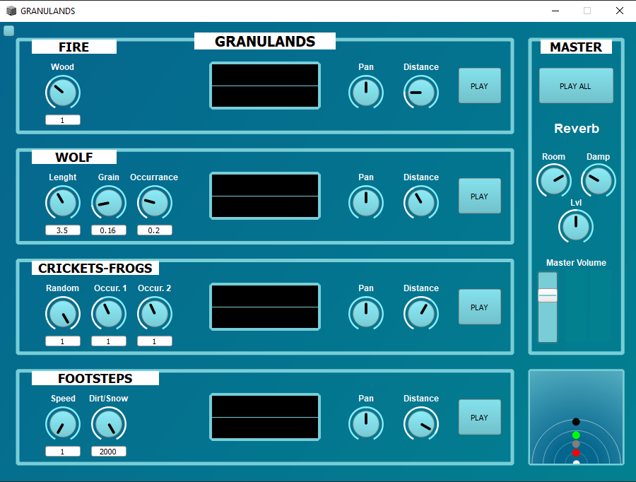
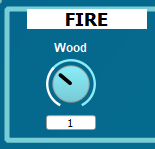
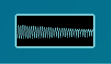
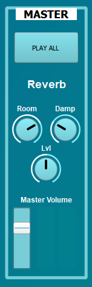
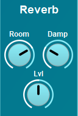
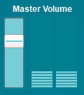
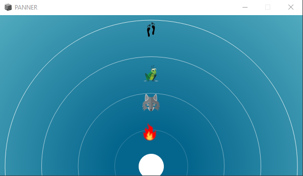

# **GRANULANDS**

 <em>Group 5 PLAS</em>

- [**GRANULANDS**](#granulands)
  - [Project Description](#project-description)
  - [Getting Started](#getting-started)
  - [Usage](#usage)
  - [Folder Structure](#folder-structure)
  - [Notes](#notes)
  - [Components](#components)

## Project Description

Project developed in [SuperCollider](https://supercollider.github.io/) environment for the course of Computer Music Languages and Systems 

Granulands consists of a granular synthesizer that plays four different **Foley** sounds, all the generated through the <em>Granular Synthesis</em> technique. It also allows the user to manipulate their characteristics and to place them around the stereo spectrum.  
 

## Getting Started

In order to test and use the synthesizer: 
1. Download the git repository
2. Open the file named with <em>PLASgui.scd</em> in [SuperCollider](https://supercollider.github.io/).
3. Run the code pressing <kbd>Ctrl</kbd> + <kbd>Enter</kbd>.


## Usage


1. The <em>GUI</em> is divided in four channelstrips, one for each sound. 
  
   * On the left side of the channel the user can find the knobs to modify the parameters affecting the generation of the sound.
   * 
   
   * The oscilloscopes allow to monitor the output of each channel.
   *  

   * Pan and distance knobs allow to control the position of the sounds in the stereo space.
   * 

   * The play button allows to select the single sound to be played 
   * 
  
2. The master section allows to control the parameters of the master channel and all the sounds generated.

  

  * The **PLAYALL** button allows to play all the sounds together and to stop some or all them if they are playing.
  * 

  * The reverb controls allow the user to modify the parameters of the reverb effect applied to the master channel
  * 
  * The Master Volume section allows to visualize the output level of the main signal
  * 

3. The panner section is composed of two elements: 
   * A little panner view in the main window allows  to visualize the changes made on the sound spatial position, and allows to open the main panner window if clicked. 
   * 
   * The main panner window allows the user to visualize the spatial position of the sounds and to move them inside the stereo spectrum by dragging them on the window.
   * 

## Folder Structure

The project repository contains one supercollider file that contains the code to run the synth and various folders:
* "buffer" contains the audio file used as source for granular synthesis. 
* "backgrounds" contains the images used as optional backgrounds for the GUI.
* "pointers" contains the images used as pointers for the panner window.
* "images" contains all the images used in the report and in the README

```
group5-HW-SC-PLAS
 ┣ backgrounds
 ┃ ┣ Fire_crop.png
 ┃ ┣ Shrek_crop.png
 ┃ ┣ Walk_crop.png
 ┃ ┗ Wolf_crop.png
 ┣ buffer
 ┃ ┗ 1.wav
 ┣ images
 ┃ ┣ attenuation-graph.png
 ┃ ┣ Fire signal flow.png
 ┃ ┣ fireGUIEx.PNG
 ┃ ┣ FireParams.PNG
 ┃ ┣ frogs signal flow.png
 ┃ ┣ Granulands.png
 ┃ ┣ littlePanner.PNG
 ┃ ┣ main patch diagram.png
 ┃ ┣ masterSection.PNG
 ┃ ┣ masterVolume.PNG
 ┃ ┣ oscilloscope.PNG
 ┃ ┣ pan&distance.PNG
 ┃ ┣ Panner.png
 ┃ ┣ playAllBTN.PNG
 ┃ ┣ playButton.PNG
 ┃ ┣ reverbSec.PNG
 ┃ ┣ steps signal flow.png
 ┃ ┗ wolf signal flow.png
 ┣ pointers
 ┃ ┣ cricket.png
 ┃ ┣ fire.png
 ┃ ┣ steps.png
 ┃ ┗ wolf.png
 ┣ LICENSE
 ┣ PLASgui.scd
 ┣ readme.md
 ┗ report1.pdf
```


## Notes

* The system has been built and tested on Windows 10 OS machines and using it on MAC OS could lead to minor GUI problems. It is suggested to close the main window and restart the system in order to fix them

## Components 
Alberto Doimo (alberto.doimo@mail.polimi.it) </p>
Paolo Ostan (paolo.ostan@mail.polimi.it) </p>

Stefano Donà (stefano2.dona@mail.polimi.it) </p>
Lorenzo Curcio (lorenzo.curcio@mail.polimi.it) </p>

